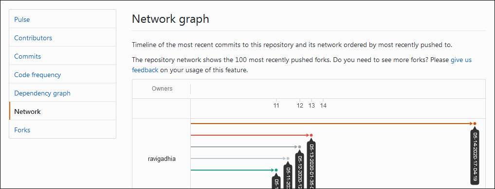

# GitHub Network Ninja

GitHub Network Ninja is a [userscript] to improve GitHub's network graphs.

Basically it provides:

-   Full-viewport network graph.
-   Searchable commit list.

## Overview

-   [Why](#why)
-   [Installation](#installation)
-   [Usage](#usage)
-   [Source Code](#source-code)
-   [Related URLs](#related-urls)
-   [Donate](#donate)
-   [License](#license)

## Why

[github.com] has a nice feature called "network graph" which displays a repo's and
its forks' commits in a network graph (DAG). This is an invaluable tool for open
source software. It allows you to see what a project's community is implementing in
different branches or forks, all in a single page. If you come across an issue with
a project, chances are it's already noticed by someone else and patched in a fork.
Some users submit their pathces via pull requests back to the origin repo; but some
others may not do so due to various reasons. This is why network graph is an
invaluable source with full of hidden gems. It's really a mistery why GitHub (again;
git; hub) doesn't promote these network graphs in everywhere possible.

[Click on the image for full size.]

However, there are some accessibility problems with network graphs. First, they are
rendered in a rather small box that makes it a pain to use. On top of that, if you
want to read commit messages you have to hover your mouse on each commit's tiny dot.
I don't even mention the lack of search.

What an awesome feature and what a miss for usability!

And I have some good news!

## Installation

This is a userscript, so in order to run it, you need a userscript manager addon for
your browser. Famous options are: Greasemonkey, Tampermonkey, Violentmonkey.

After installing that addon, visit the below URL:

https://github.com/maliayas/github-network-ninja/raw/master/main.user.js

Some userscript managers automatically trigger installation when they see `.user.js`
at the end of the URL. If that doesn't work, just create a new userscript in the
manager and paste the code you see in the open tab into it. After saving it, you're
done. Now go to a GitHub network page to see if it works.

This userscript is tested and runs successfully on:

-   Firefox 77.0b6
    -   [Greasemonkey] 4.9
-   Waterfox 2020.03.1
    -   Greasemonkey 3.17 (installed via [Classic Add-ons Archive])
-   Chrome/Chromium 67.0.3396.87
    -   [Tampermonkey] 4.10
    -   [Violentmonkey] 2.12.7

P.S. Tampermonkey on Firefox 77.0b6 doesn't seem to work anymore. Firefox in the
recent years really failed to be a stable platform to depend on. If you're worried
about this, you can try its forks like Waterfox, Palemoon, etc.

## Usage

Once you installed the userscript, browse any network graph page on GitHub in order
to make use of it. The userscript runs only on URLs in this pattern:
`https://github.com/*/*/network`

This userscript provides you a full-viewport network graph so you can see the big
picture more easily. It's automatic, you don't need to do anything.

[Click on the image for full size.]

And a killer feature. Or a dream feature should I say? It gives you a list of all
the commits with a search box on top of it!

[Click on the image for full size.]

Click on the "List of commits" button on the top-tight corner to open the commit
list. You'll see a list of unique commits from the origin repo and its forks.
Commits in that list corresponds to the dots in the network graph (same amount).

Explanations about the columns:

-   __Column 1__: Commit author (not to confuse with commiter, which simply applies
    a given commit)
-   __Column 2__: Top line of the commit message. If the commit doesn't exist in the
    origin repo (i.e. not merged or pulled) then the message will be in bold. This
    helps to easily spot them since they might be considered more interesting if
    you're in search of a patch in the wild.
-   __Column 3__: Commit date (not to confuse with author date). They are _in the
    local timezone_ of the commiter; so you may notice slight shifts in the ordering
    which is caused by commits from different timezones. I don't have any control
    over these dates, or have any timezone info attached in order to convert them to
    a central timezone. Also a side info: The date you see on a commit's page is its
    _author date_ in _your timezone_.

Ordering of the list is not changed by the userscript. GitHub by default orders them
by _some date_; either author or commit date, I don't know which. But it looks like
that ordering happens on timestamp values (which is independant from timezones) and
this makes the ordering reliable. This is also why the shifts mentioned in "Column
3" description above happens.

A maximum of 10,000 commits are displayed in the commit list. They're fetched from
the GitHub API 500 at a time; with 1 second of waiting between requests. All these
numbers are defined by the userscript and not mandated by GitHub; so they are
subject to change in the future depending on user feedback.

Once the commit list is fully fetched from GitHub, searching is completely offline.
Please be respectful to GitHub by loading a network graph page only once. To help you
with this, the userscript will open commits you click in new tabs.

In order to dismiss the commit list you can either hit <kbd>ESC</kbd> or click
outside of the popup.

## Source Code

Source code is hosted here: https://github.com/maliayas/github-network-ninja

## Related URLs

-   https://github.com/dear-github/dear-github/issues/175

## Donate

If you want to support further creative work, you may consider a donation.

-   BTC:[bc1qh2uq38mnvduzc5de9ak2f6ylxx43hs0xurp0eu](http://maliayas.com/business/donation/crypto-qr.php?coin=bitcoin&address=bc1qh2uq38mnvduzc5de9ak2f6ylxx43hs0xurp0eu&amount=0.0005)
-   ETH:[0x657b5B25360BA5266e3c5D5540dB4b441e97bff6](http://maliayas.com/business/donation/crypto-qr.php?coin=ethereum&address=0x657b5B25360BA5266e3c5D5540dB4b441e97bff6&amount=0.025)

## License

GitHub Network Ninja is released under the [MIT License](LICENSE).

[userscript]: https://en.wikipedia.org/wiki/Userscript
[github.com]: https://github.com
[Tampermonkey]: https://chrome.google.com/webstore/detail/tampermonkey/dhdgffkkebhmkfjojejmpbldmpobfkfo
[Violentmonkey]: https://chrome.google.com/webstore/detail/violentmonkey/jinjaccalgkegednnccohejagnlnfdag
[Greasemonkey]: https://addons.mozilla.org/en-US/firefox/addon/greasemonkey/
[Classic Add-ons Archive]: https://github.com/JustOff/ca-archive
